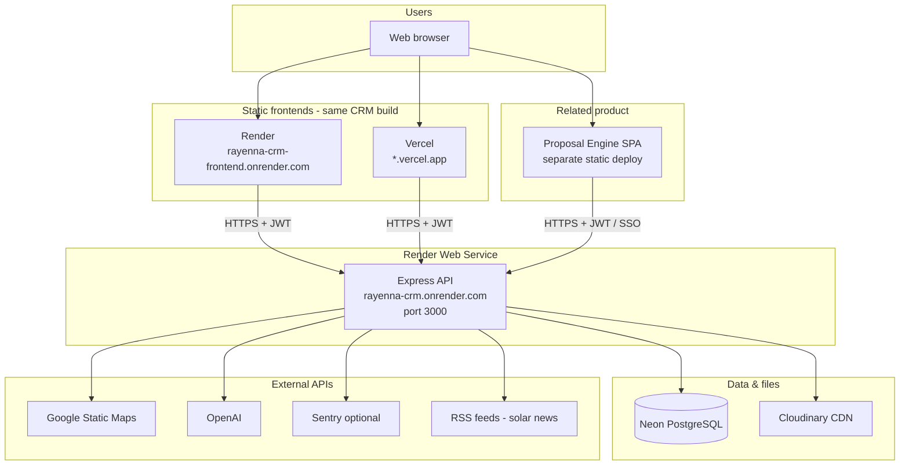
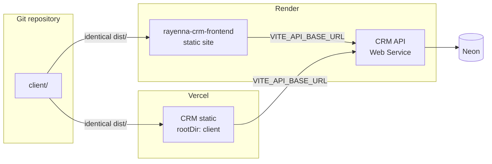
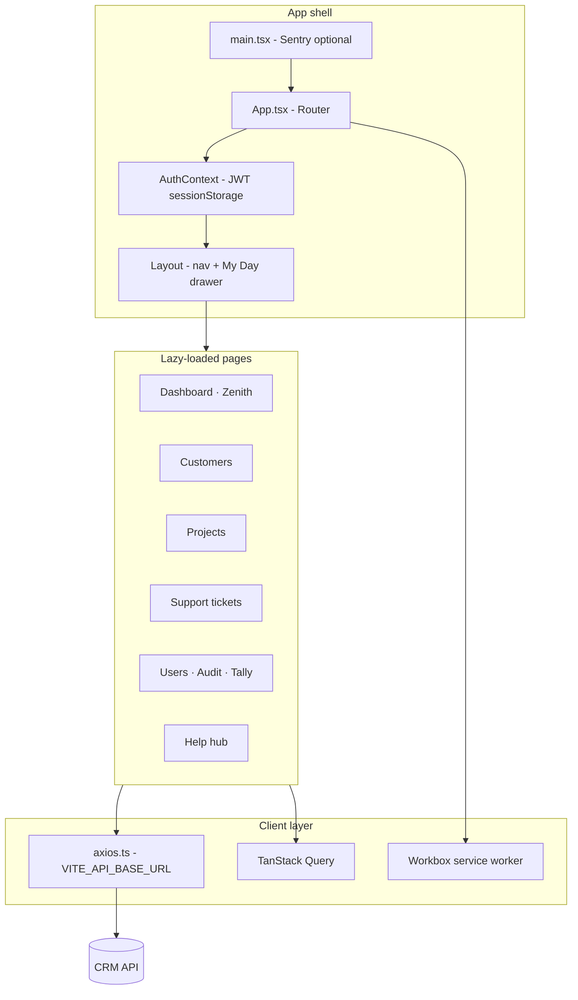
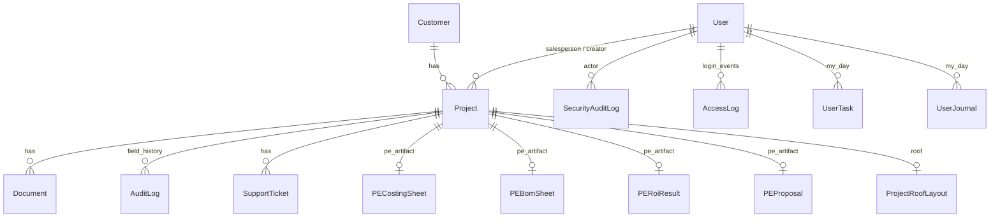
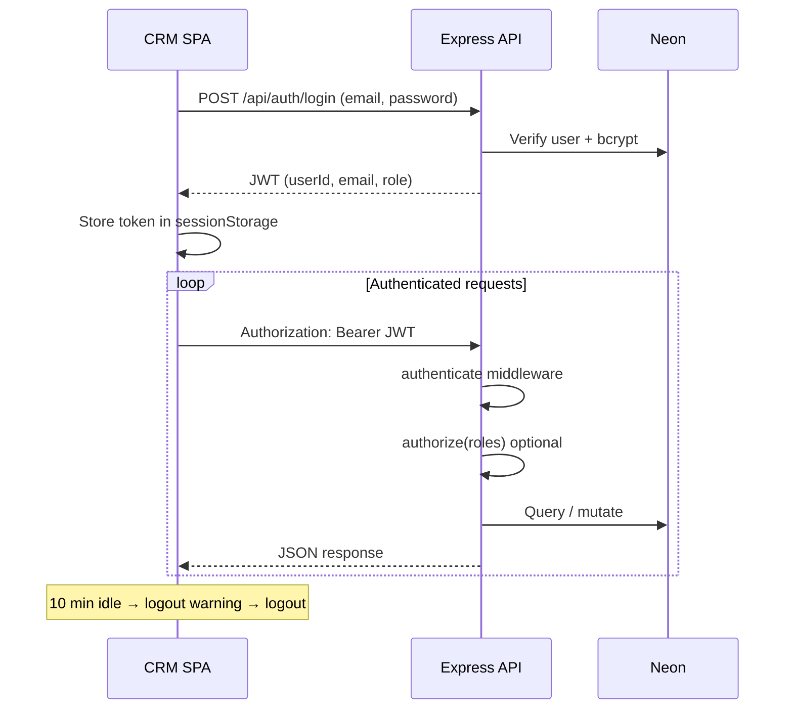
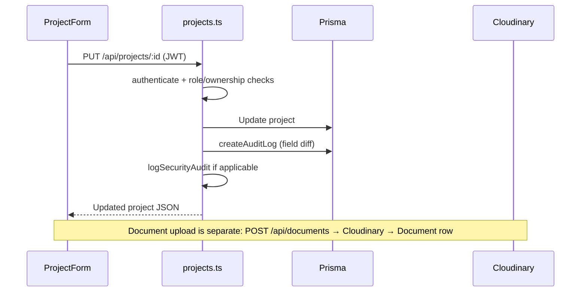
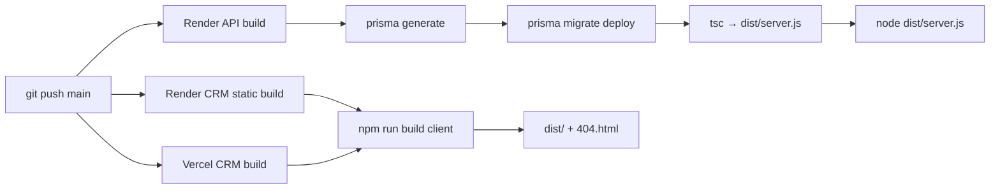

# Rayenna CRM — Architecture

**Audience:** Engineers, DevOps, integrators  
**Last updated:** June 2026  
**Companion:** [RAYENNA_CRM_BRIEFING.md](./RAYENNA_CRM_BRIEFING.md)

---

## 1. System context

Rayenna CRM is a **three-tier** system: static React SPA → Node/Express API → PostgreSQL. External services handle files, maps, AI, and optional observability.



---

## 2. Deployment topology

### 2.1 Dual CRM frontend (Render + Vercel)

One codebase (`client/`), one build (`npm run build` → `dist/`), two static hosts for business continuity.



| Artifact | Path | Host |
|----------|------|------|
| CRM frontend build | `client/dist/` | Render static + Vercel |
| CRM API | `dist/server.js` | Render Web Service |
| DB migrations | `prisma/migrations/` | Run on API build (`migrate deploy`) |
| SPA fallback (Render) | `client/dist/404.html` | Copied at build; no blanket `/*` rewrite |
| SPA fallback (Vercel) | `client/vercel.json` | Rewrite to `index.html` |

Config references: `render.yaml`, `client/vercel.json`, root `vercel.json`, `.cursor/rules/dual-frontend-render-vercel.mdc`.

### 2.2 CORS

API allows explicit origins plus `*.vercel.app`, `render.com`, and localhost dev ports (`src/server.ts`). New production frontend URLs must be added to the allow list.

### 2.3 Proposal Engine (sibling deploy)

Proposal Engine UI is a **separate static site** (`proposal-engine/frontend`) on Render and Vercel. It does **not** share the CRM frontend build. It calls the **same CRM API** at `/api/proposal-engine` and related routes.

---

## 3. Application architecture

### 3.1 Backend (`src/`)

```mermaid
flowchart TB
  subgraph entry [server.ts]
    Health[/health - first]
    MW[helmet · cors · compression · json 25mb]
    Router[/api router - lazy loaded]
  end

  subgraph middleware [Middleware]
    Auth[authenticate / authorize]
    RL[rateLimit - login]
  end

  subgraph routes [Route modules]
    AuthR[auth]
    Proj[projects]
    Cust[customers]
    Doc[documents]
    Dash[dashboard + enhanced + wordcloud]
    Sup[support-tickets]
    Audit[admin/audit]
    PE[proposal-engine]
    Roof[roof]
    MD[my-day]
    Other[leads · users · tally · pdf · ...]
  end

  subgraph services [Services & utils]
    Prisma[Prisma client]
    AuditLog[audit.ts + auditLogger.ts]
    AI[ai.ts · proposalGenerator]
    RoofSvc[satelliteFetcher · roofLayoutImageStorage]
  end

  Health --> MW --> Router
  Router --> Auth
  Auth --> routes
  routes --> Prisma
  routes --> services
```

**Startup pattern:** `/health` responds before Prisma and routes load (Render 5s deploy health). Routes import asynchronously after `listen()`.

### 3.2 API route map

| Mount | Module | Responsibility |
|-------|--------|----------------|
| `/api/auth` | `routes/auth.ts` | Login, JWT, `/me`, theme, SSO tickets, password reset |
| `/api/projects` | `routes/projects.ts` | CRUD, filters, payments, AI proposal hooks, exports |
| `/api/customers` | `routes/customers.ts` | Customer master, GPS, exports |
| `/api/documents` | `routes/documents.ts` | Upload/download (Cloudinary) |
| `/api/dashboard` | `routes/dashboard.ts` | Role dashboards |
| `/api/dashboard-enhanced` | `routes/dashboard-enhanced.ts` | Enhanced dashboards |
| `/api/dashboard` | `routes/wordcloud.ts` | Profitability word cloud |
| `/api/tally` | `routes/tally.ts` | Tally accounting export |
| `/api/users` | `routes/users.ts` | User admin |
| `/api/leads` | `routes/leads.ts` | Lead pipeline |
| `/api/site-surveys` | `routes/siteSurveys.ts` | Site surveys |
| `/api/proposals` | `routes/proposals.ts` | Legacy CRM proposals |
| `/api/installations` | `routes/installations.ts` | Installations |
| `/api/invoices` | `routes/invoices.ts` | Invoices |
| `/api/amc` | `routes/amc.ts` | AMC contracts |
| `/api/support-tickets` | `routes/supportTickets.ts` | Support workflow |
| `/api/service-tickets` | `routes/serviceTickets.ts` | Legacy tickets |
| `/api/sales-team-performance` | `routes/salesTeamPerformance.ts` | Sales KPIs |
| `/api/remarks` | `routes/remarks.ts` | Project remarks |
| `/api/admin/audit` | `routes/adminAudit.ts` | Security + access logs, exports, field history API |
| `/api/proposal-engine` | `routes/proposalEngine.ts` | PE sync, costing, BOM, ROI, proposals, share links |
| `/api/solar-news` | `routes/solarNews.ts` | Cached RSS aggregation |
| `/api/roof` | `routes/roofLayout.ts` | Roof layout, satellite, AI layout, 3D assets |
| `/api/my-day` | `routes/myDay.ts` | Tasks, journal, reminders |
| `/api/` | `routes/pdf.ts` | Puppeteer HTML→PDF |
| `/health`, `/api/health` | `server.ts` | Liveness |

### 3.3 Frontend (`client/`)



| Concern | Implementation |
|---------|----------------|
| Routing | React Router v6, `PrivateRoute` for auth |
| State | TanStack Query for server state; AuthContext for session |
| API base | `import.meta.env.VITE_API_BASE_URL` (unset in local dev → Vite proxy to :3000) |
| Token | `sessionStorage`, `Authorization: Bearer` |
| PWA | `vite-plugin-pwa`; `sw.js` no-cache headers on deploy |
| Charts | Recharts (Dashboard, Zenith, Audit) |

Key entry: `client/src/App.tsx`, `client/src/components/Layout.tsx`, `client/vite.config.ts`.

---

## 4. Data architecture

Single **Neon PostgreSQL** database. Prisma ORM with pooled `DATABASE_URL` and `DIRECT_URL` for migrations.



### 4.1 Model groups

| Group | Models | Notes |
|-------|--------|-------|
| **Identity** | `User` | Roles, theme, password reset tokens |
| **CRM core** | `Customer`, `Lead`, `Project` | Central business entities |
| **Execution** | `SiteSurvey`, `Proposal`, `Installation`, `Invoice`, `Payment`, `AMCContract` | Pipeline artifacts |
| **Collaboration** | `Document`, `ProjectRemark`, `SupportTicket`, `SupportTicketActivity` | Files and comms |
| **Audit** | `AuditLog`, `SecurityAuditLog`, `AccessLog` | Field history vs security events |
| **Productivity** | `UserTask`, `UserJournal` | My Day (per-user) |
| **Proposal Engine** | `PECostingSheet`, `PEBomSheet`, `PERoiResult`, `PEProposal`, `PECostingTemplate`, `PESharedProposal`, `PESelectedProject`, `PERemovedProject` | Server-authoritative PE state |
| **Roof** | `ProjectRoofLayout` | Geometry JSON + Cloudinary image URLs |

Schema source: `prisma/schema.prisma`.

### 4.2 Two audit streams

| Table | Written by | Consumed by |
|-------|------------|-------------|
| `audit_logs` | `createAuditLog()` on project field changes | Project field history tab, project detail |
| `security_audit_logs` | `logSecurityAudit()` on security-sensitive actions | Audit & Security admin page |
| `access_logs` | `logAccess()` on login success/failure | Failed logins, login trend charts |

---

## 5. Authentication and authorization



| Mechanism | Detail |
|-----------|--------|
| Token | JWT (`JWT_SECRET`, default expiry `7d`) |
| Password | bcrypt |
| Role gate | `authorize(UserRole.ADMIN, ...)` on sensitive routes |
| Data scope | Sales often limited to own customers/projects; Admin/Management broader (per-route logic) |
| SSO | Short-lived in-memory tickets for Proposal Engine handoff (`/api/auth/sso-ticket`) |
| Login protection | Rate limit ~15 attempts / 15 min / IP |

---

## 6. Integrations

| Service | Env vars | Usage |
|---------|----------|-------|
| **Neon** | `DATABASE_URL`, `DIRECT_URL` | All persistent data |
| **Cloudinary** | `CLOUDINARY_CLOUD_NAME`, `CLOUDINARY_API_KEY`, `CLOUDINARY_API_SECRET` | Project documents, roof layout images |
| **Google Maps** | `GOOGLE_MAPS_API_KEY` | Satellite imagery for AI roof layout |
| **OpenAI** | `OPENAI_API_KEY` | AI proposal text, delay/pricing helpers |
| **JWT / app** | `JWT_SECRET`, `FRONTEND_URL` | Auth and reset links |
| **Sentry** | `SENTRY_DSN`, `VITE_SENTRY_DSN` | Optional error monitoring |
| **Puppeteer** | (bundled) | Server-side PDF generation |

**Email:** No SMTP/transactional email provider is integrated. Password reset uses admin-generated links via `FRONTEND_URL`.

**Solar news:** Public RSS feeds fetched and cached in memory (~30 min) — no paid news API.

---

## 7. Request flow (example: project update)



---

## 8. Build and release pipeline



| Step | CRM API | CRM frontend |
|------|---------|--------------|
| Install | `npm install` (root) | `npm install` in `client/` |
| Build | `prisma generate` + migrate + `tsc` | `tsc` + `vite build` + `copy-404.cjs` |
| Run | `node dist/server.js` | Static CDN |
| Env | Secrets on Render dashboard | `VITE_API_BASE_URL` on Render/Vercel |

---

## 9. Repository layout

```
rayenna_crm/
├── client/                 # CRM React SPA (Vite)
│   ├── src/
│   │   ├── pages/          # Route pages
│   │   ├── components/     # UI components
│   │   ├── help/           # In-app help (Markdown)
│   │   └── utils/          # axios, formatters, etc.
│   └── vercel.json
├── src/                    # Express API
│   ├── server.ts
│   ├── routes/
│   ├── middleware/
│   ├── services/
│   └── utils/
├── prisma/
│   └── schema.prisma
├── proposal-engine/        # Separate product (do not mix in CRM commits)
├── render.yaml             # Render static services blueprint
├── vercel.json             # Vercel build from repo root (CRM)
└── docs/                   # Engineering docs (this file)
```

**Isolation rule:** CRM commits touch `client/`, `src/`, `prisma/` only. Proposal Engine commits touch `proposal-engine/` only.

---

## 10. Operational considerations

| Topic | Behavior |
|-------|----------|
| API cold start | Render free tier may hibernate; client uses 90s axios timeout |
| JSON body limit | 25 MB (large PE payloads; PE limit events audited) |
| PE images | Base64 in `pe_proposals` today; Cloudinary migration planned at scale threshold |
| Shared workstations | PE list badges and CRM-linked data must come from API, not `localStorage` alone |
| Health | `GET /health` before DB load for deploy probes |
| Signed audit PDF | Landscape A4, shared `buildAuditPdfBuffer()` in `adminAudit.ts` |

---

## 11. Key file index

| Area | Path |
|------|------|
| API entry | `src/server.ts` |
| Auth | `src/middleware/auth.ts`, `src/routes/auth.ts` |
| Prisma schema | `prisma/schema.prisma` |
| CRM routes | `src/routes/*.ts` |
| CRM app router | `client/src/App.tsx` |
| API client | `client/src/utils/axios.ts` |
| Auth context | `client/src/contexts/AuthContext.tsx` |
| Render blueprint | `render.yaml` |
| Deploy rules | `.cursor/rules/rayenna-deploy-neon.mdc` |
| Dual frontend rules | `.cursor/rules/dual-frontend-render-vercel.mdc` |

---

*For business-oriented overview and module descriptions, see [RAYENNA_CRM_BRIEFING.md](./RAYENNA_CRM_BRIEFING.md).*
